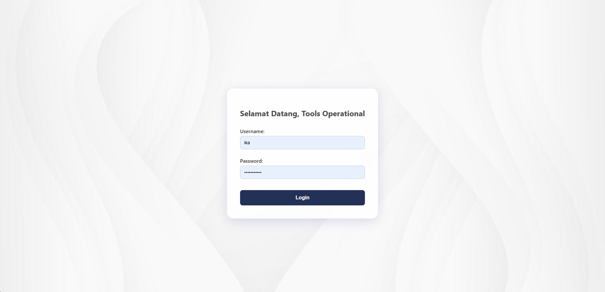
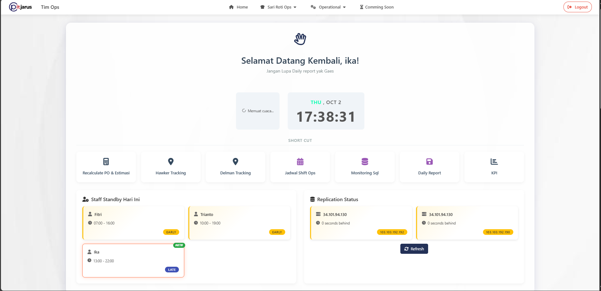
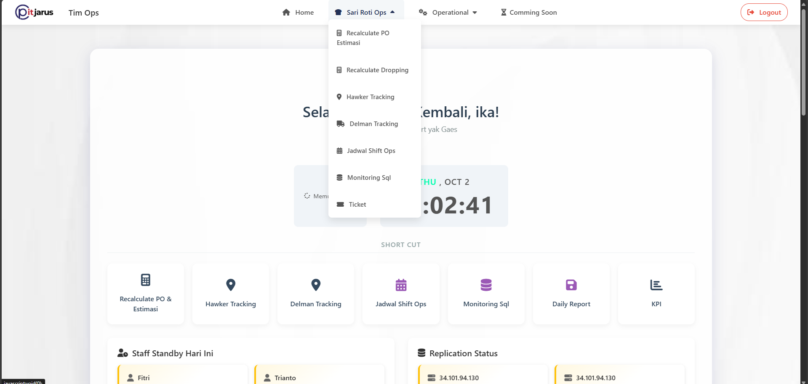

# Internal Web Dashboard – Tim Operasional

## 📌 Deskripsi

Aplikasi web sederhana yang dikembangkan sebagai inisiatif internal untuk membantu tim operasional dalam mengotomatisasi proses manual yang sebelumnya memakan banyak waktu.
Project ini bertujuan meningkatkan efisiensi kerja dengan menghadirkan fitur dashboard interaktif, pengolahan data otomatis, dan visualisasi yang mudah dipahami.
Dashboard ini rencananya akan dikembangkan untuk proses operational tim data dan untuk monitoring data quality

## 🎯 Tujuan

- Mengurangi pekerjaan manual berulang dengan otomatisasi berbasis web.
- mempermudah proses recalculate data yang anomali sehingga data quality tetap terjaga.
- Memberikan akses cepat ke data yang relevan melalui dashboard.
- Mempermudah monitoring kinerja tim dengan visualisasi yang informatif.

## ⚙️ Teknologi yang Digunakan

#### Backend: Flask (Python)
#### Frontend: Bootstrap / Tailwind / HTML / CSS
#### Database: MySQL (versi internal menggunakan database perusahaan, tidak bisa dishare pada repository ini)
#### Deployment: server internal perusahaan

## 🚀 Fitur Utama

1. Login sederhana (versi demo: dummy auth).
2. Dashboard ringkas untuk monitoring data.
3. Menu Operational untuk SariRoti
   - Menu recalculate data
   - Menu hawker tracker
   - Jadwal shifting tim data
   - Monitoring anomali data
   - Tiketing request
4. Menu Operational general

## 📑 Dokumentasi beberapa fitur web
Beberapa dokumentasi berikut adalah sebagian kecil dari keseluruhan dashbaord opertaional, fitur yang ditampilkan merupakan hasil kerja penulis. Data yang dimasukkan adalah data dummy. 
 
<!--   
 
  -->
 

## 📊 Dampak / Manfaat

Dashboard internal ini memiliki beberapa manfaat baik untuk internal tim data serta klien dalam hal ini SariRoti, diantaranya:

- Efisiensi: Menghemat waktu tim ±20% dibanding proses manual dalam proses recalculate data.
- Akurasi: Mengurangi risiko human error dalam pengolahan data yang dapat mempengaruhi sales.
- Kolaborasi: Memudahkan tim dalam mengakses monitoring data anomali agar segera dapat ditangani.

## 📝 Catatan

Kode asli & data internal tidak dipublikasikan karena bersifat rahasia perusahaan.
Repository ini hanya berisi dokumentasi, struktur umum, dan contoh dummy untuk menunjukkan konsep dan arsitektur aplikasi.

